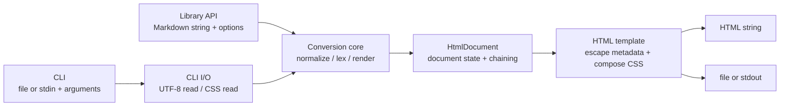
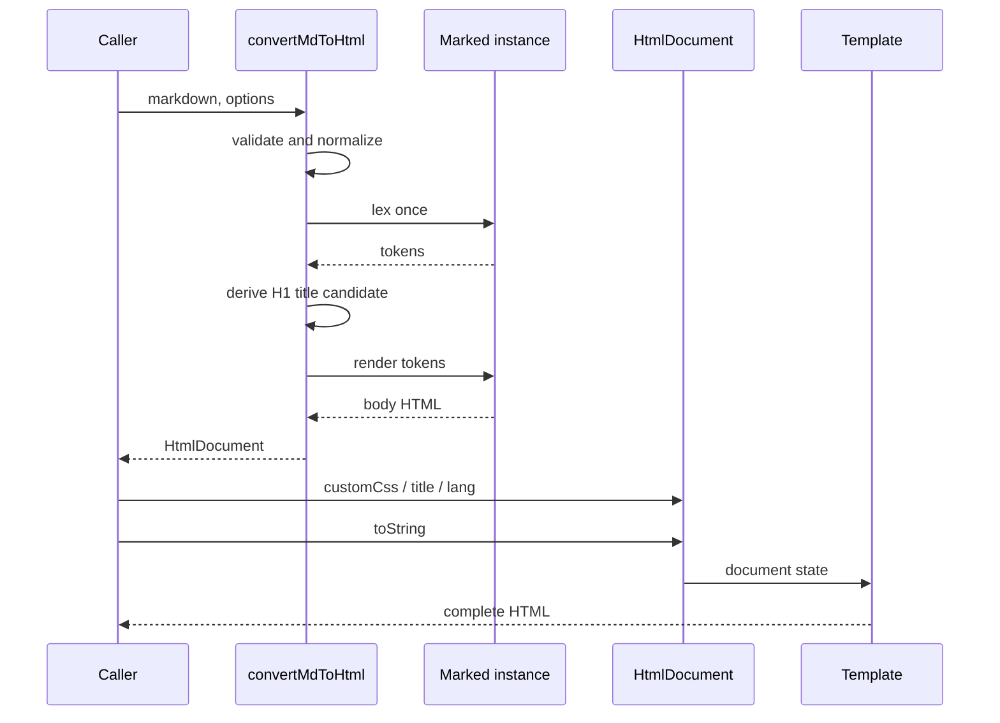

# Markdown → HTML 変換ライブラリ＆CLI 基本設計書

## 1. 文書情報

| 項目 | 内容 |
| --- | --- |
| 対象 | `md2html` ライブラリおよびCLI |
| 入力資料 | `docs/REQUIREMENTS.md`, `DESIGN.md` |
| 設計対象バージョン | 1.0.0 |
| ステータス | 基本設計 |

## 2. 目的

Markdown文字列またはMarkdownファイルを、既定のデザインと必要なメタ情報を含む完全なHTML文書へ同期変換する。

同一の変換コアを次の2つの入口から利用可能にする。

- JavaScript / TypeScript向けライブラリAPI
- Node.js向けコマンドラインインターフェース

生成物は外部CDN、Webフォント、JavaScriptへ依存しない。HTMLファイル単体で本文の表示と既定スタイルの適用が完結する。

## 3. 設計方針と技術選定

### 3.1 採用構成

| 区分 | 採用 | 方針 |
| --- | --- | --- |
| 実装言語 | TypeScript | 公開型定義を同梱し、strictモードで実装する |
| Markdownパーサー | `marked` | Node.jsとブラウザの双方で利用でき、依存がなく軽量 |
| CLI引数解析 | Node.js標準 `util.parseArgs` | Node.js 20以降で安定API。CLI専用依存を増やさない |
| ビルド | `tsdown` | ESM/CJS、型定義、複数エントリーの生成に利用 |
| テスト | Vitest | TypeScriptとの統合、スナップショット、カバレッジに利用 |
| 配布形式 | ESM + CJS + CLI | ESMを主形式とし、既存利用者向けにCJSも提供する |
| 対応Node.js | `>=22.18.0` | サポート中のLTSを対象とし、開発ツールの要件とも揃える |

依存バージョンは実装開始時点の安定版メジャーを採用し、ロックファイルへ固定する。依存の自動更新時にもメジャー更新は個別レビューする。

### 3.2 要件案からの変更

- `tsup` は積極的な保守が終了しているため、後継として案内されている `tsdown` を採用する。
- `cac` は使用せず、対応Node.jsに標準搭載された `util.parseArgs` を使用する。
- `marked` の型を公開APIへ露出させない。パーサーを将来変更しても利用者側への影響を抑える。
- 生HTMLは既定でエスケープする。必要な利用者だけ明示的に許可できる設計とする。
- Builderは要件例との互換性を優先して可変とする。チェーンの戻り値を受け取らない呼び出しでも変更が保持される。

### 3.3 参照した技術情報

- Marked公式ドキュメント: <https://marked.js.org/>
- Node.js `util.parseArgs`: <https://nodejs.org/api/util.html#utilparseargsconfig>
- Node.jsリリース状況: <https://nodejs.org/en/about/previous-releases>
- tsdown公式ドキュメント: <https://tsdown.dev/guide/>
- tsup保守状況: <https://github.com/egoist/tsup>

## 4. スコープ

### 4.1 対象

- Markdown文字列から完全なHTML文書への同期変換
- GFM相当の基本構文
- `DESIGN.md` を記事表示向けに適用した既定CSS
- CSS文字列の追加と既定CSSの無効化
- タイトル、文書言語の設定
- ライブラリのメソッドチェーン
- 単一Markdownファイルを変換するCLI
- 標準入力、標準出力
- ESM、CJS、TypeScript型定義のnpm配布

### 4.2 1.0.0では対象外

- 複数ファイルの一括変換
- ファイル監視、開発サーバー
- 目次の自動生成
- 見出しID、アンカーリンクの自動生成
- シンタックスハイライト
- Mermaid、数式、脚注
- YAML Front Matter
- Markdown拡張プラグインAPI
- PDF生成
- 外部URLからの入力取得
- 画像やリンク先ファイルのHTMLへの埋め込み
- ブラウザ単体でのファイル入出力

## 5. システム構成



### 5.1 レイヤー責務

| レイヤー | 責務 | 禁止事項 |
| --- | --- | --- |
| Public API | 引数検証、公開型、変換ファクトリーの提供 | Node.js専用APIへの依存 |
| Conversion core | Markdown解析、HTML本文生成、タイトル候補抽出 | ファイルI/O |
| Document | タイトル、言語、CSS、本文の状態管理 | Markdownの再解析 |
| Template | 完全なHTML文書の組み立てと文脈別エスケープ | ファイルI/O |
| CLI | 引数解析、パス検証、UTF-8入出力、終了コード制御 | 独自のMarkdown変換 |

CLIは必ず公開APIと同じ変換コアを利用する。ライブラリとCLIで変換結果が分岐しない構造とする。

## 6. プロジェクト構成

```text
md2html/
├─ docs/
│  ├─ REQUIREMENTS.md
│  ├─ BASIC_DESIGN.md
│  ├─ IMPLEMENTATION_TASKS.md     # 実装順序、受入条件、品質ゲート
│  ├─ IMPLEMENTATION_REPORT.md    # 実装者が更新するレビュー引継ぎ票
│  └─ REVIEW_GUIDE.md             # 完了後レビューの手順と観点
├─ src/
│  ├─ index.ts                    # npm公開API
│  ├─ cli.ts                      # CLIエントリー、先頭にshebang
│  ├─ core/
│  │  ├─ convert.ts               # 変換ユースケース
│  │  ├─ markdown-renderer.ts     # markedのインスタンスとRenderer
│  │  ├─ html-document.ts         # HtmlDocument
│  │  ├─ html-template.ts         # 完全なHTML文書生成
│  │  └─ types.ts                 # 公開・内部型
│  ├─ cli/
│  │  ├─ args.ts                  # parseArgs設定と利用方法
│  │  ├─ paths.ts                 # 入出力パス解決、同一パス防止
│  │  └─ run.ts                   # I/Oと終了コード
│  ├─ styles/
│  │  └─ default-css.ts           # DEFAULT_CSSの唯一の定義元
│  └─ utils/
│     ├─ escape.ts                # HTML/style文脈のエスケープ
│     └─ url.ts                   # link/image URL検証
├─ test/
│  ├─ unit/
│  ├─ integration/
│  └─ fixtures/
├─ package.json
├─ package-lock.json
├─ tsconfig.json
├─ tsdown.config.ts
├─ vitest.config.ts
├─ README.md
└─ LICENSE
```

`LICENSE` の内容とnpm上のパッケージ名の利用可否は、公開前にプロジェクト所有者が確定する。

## 7. ライブラリAPI設計

### 7.1 公開エクスポート

```typescript
export {
  convertMdToHtml,
  HtmlDocument,
  DEFAULT_CSS,
  Md2HtmlError,
};

export type {
  ConvertOptions,
  RawHtmlMode,
  Md2HtmlErrorCode,
};
```

### 7.2 変換関数

```typescript
function convertMdToHtml(
  markdown: string,
  options?: Readonly<ConvertOptions>,
): HtmlDocument;
```

- 同期関数とする。
- `markdown` が文字列でない場合は `Md2HtmlError` を送出する。
- 入力先頭のBOMと、Markedの解析へ影響する既知のゼロ幅文字を除去する。
- Markdown解析は呼び出し時に一度だけ行う。
- 戻り値の文字列化時にはMarkdownを再解析しない。

### 7.3 変換オプション

```typescript
type RawHtmlMode = "escape" | "allow";

interface ConvertOptions {
  title?: string;
  lang?: string;
  defaultCss?: boolean;
  customCss?: string | readonly string[];
  rawHtml?: RawHtmlMode;
  gfm?: boolean;
  breaks?: boolean;
}
```

| オプション | 既定値 | 内容 |
| --- | --- | --- |
| `title` | 自動決定 | HTMLの`title`。明示値を最優先する |
| `lang` | `"und"` | HTMLの文書言語。未指定はundetermined |
| `defaultCss` | `true` | 既定CSSを含める |
| `customCss` | `[]` | 既定CSSの後へ追加するCSS |
| `rawHtml` | `"escape"` | Markdown中の生HTMLの扱い |
| `gfm` | `true` | テーブル、取り消し線、タスクリスト等 |
| `breaks` | `false` | 単一改行を`br`へ変換するか |

未知のオプションはTypeScriptでは型エラーとなる。JavaScript実行時には認識するキーだけを読み、値の型または値域が不正な場合はエラーとする。

### 7.4 `HtmlDocument`

```typescript
class HtmlDocument {
  title(value: string): this;
  lang(value: string): this;
  customCss(css: string): this;
  useDefaultCss(enabled?: boolean): this;
  toString(): string;
  [Symbol.toPrimitive](hint: "string" | "number" | "default"): string;
}
```

#### 動作規約

- 各設定メソッドは自身を変更し、同じインスタンスを返す。
- `customCss()` は呼び出し順にCSSを追加する。後のCSSほど優先される。
- `useDefaultCss()` の引数省略時は `true` とする。
- `toString()` は同じ状態に対して常に同一の文字列を返す。
- `toString()` はインスタンス状態を変更しない。
- `String(document)` とテンプレートリテラルは `toString()` と同じHTMLを返す。
- `valueOf()` へ特殊な意味は持たせない。

内部状態は外部へ公開せず、変換済み本文、タイトル候補、タイトル、言語、既定CSSフラグ、カスタムCSS配列を保持する。

### 7.5 利用例

```typescript
import { convertMdToHtml } from "md2html";

const document = convertMdToHtml("# Hello", { lang: "ja" });

document.customCss("h1 { color: red; }");

console.log(document.toString());
console.log(`${document}`);
```

チェーン形式も同じ結果になる。

```typescript
const html = convertMdToHtml("# Hello")
  .title("Greeting")
  .customCss(".md2html h1 { color: red; }")
  .toString();
```

## 8. CLI設計

### 8.1 コマンド形式

```text
md2html <input.md | -> [options]
```

`npx md2html` でも同じコマンドを起動できるよう、`package.json` の `bin` に登録する。

### 8.2 オプション

| オプション | 短縮 | 値 | 内容 |
| --- | --- | --- | --- |
| `--output` | `-o` | path | 出力HTMLパス |
| `--css` | なし | path | CSSファイル。複数回指定可能 |
| `--title` | なし | text | HTMLタイトル |
| `--lang` | なし | tag | 文書言語 |
| `--no-default-css` | なし | なし | 既定CSSを含めない |
| `--allow-html` | なし | なし | Markdown中の生HTMLを許可 |
| `--stdout` | なし | なし | HTMLを標準出力へ出す |
| `--force` | `-f` | なし | 既存の出力ファイルを上書きする |
| `--help` | `-h` | なし | ヘルプを表示 |
| `--version` | `-v` | なし | バージョンを表示 |

### 8.3 入出力規則

1. 入力は1ファイルまたは `-` による標準入力だけを受け付ける。
2. ファイル入力で `--output` と `--stdout` の双方がない場合、入力と同じディレクトリへ拡張子を `.html` に変更して出力する。
3. 標準入力では `--stdout` または `--output` を必須とする。
4. `--output` と `--stdout` の同時指定は利用方法エラーとする。
5. `--css` は指定順にUTF-8で読み、既定CSSの後へ追加する。
6. 入力、CSS、出力パスはCLI起動時のカレントディレクトリを基準に解決する。
7. 入力ファイルまたはいずれかのCSSファイルと、出力ファイルが正規化後に同一の場合は、`--force` の有無にかかわらず拒否する。
8. 出力済みファイルが存在する場合は既定で拒否し、`--force` 指定時のみ置換する。
9. ファイルはUTF-8として読み書きし、出力改行はLFとする。
10. ファイル出力成功時は標準出力へ何も書かない。エラーと診断だけを標準エラー出力へ書く。

ファイル出力は同じディレクトリの一時ファイルへ完全に書き込んだ後に置換し、変換失敗による不完全な出力を残さない。失敗時は一時ファイルを削除する。

### 8.4 タイトル決定順

1. ライブラリの `title` またはCLIの `--title`
2. 最初のレベル1見出しをプレーンテキスト化した値
3. CLIでは入力ファイルの拡張子を除いた名前
4. ライブラリまたは標準入力では `"Markdown Document"`

空文字を明示指定した場合は不正値とせず、空の `title` として扱う。自動抽出した見出しが空の場合は次の候補へ進む。

### 8.5 終了コード

| コード | 意味 |
| --- | --- |
| `0` | 成功、ヘルプ、バージョン表示 |
| `1` | 入出力または変換処理の失敗 |
| `2` | 引数、オプション、組み合わせの不正 |

想定内のエラーではスタックトレースを表示しない。予期しないエラーも利用者向けメッセージへ整形し、開発・テスト時だけ原因をログで確認できるようにする。

### 8.6 実行例

```bash
npx md2html input.md -o output.html --css ./custom.css --lang ja
```

```bash
cat input.md | npx md2html - --stdout > output.html
```

## 9. Markdown変換設計

### 9.1 変換フロー



### 9.2 パーサーの扱い

- グローバルな `marked` インスタンスへ設定を追加しない。
- 変換モジュールが管理する独立した `Marked` インスタンスとRendererを使用する。
- 外部から任意のMarkedオプションや拡張を渡させない。
- `gfm` と `breaks` だけを安定した自前オプションとして公開する。
- 非同期Rendererは使用しない。
- タイトル抽出と本文生成は同じtoken列を使用する。

### 9.3 Renderer拡張

| 対象 | 拡張内容 |
| --- | --- |
| 生HTML | `escape` では文字参照へ変換、`allow` ではそのまま出力 |
| link | URLポリシーを適用し、不許可URLではリンクを外して表示文字だけを残す |
| image | URLポリシーを適用し、不許可URLではalt文字列だけを残す |
| table | 横スクロール用の `.md2html-table-wrap` で囲む |
| checkbox | 操作用途ではないためdisabled属性を付与したまま出力 |

見出しIDは1.0.0では生成しない。同名見出し、Unicode正規化、アンカー互換性といった追加仕様を不用意に公開契約へ含めないためである。

## 10. HTML文書設計

### 10.1 文書構造

```html
<!doctype html>
<html lang="und">
<head>
  <meta charset="utf-8">
  <meta name="viewport" content="width=device-width, initial-scale=1">
  <title>Markdown Document</title>
  <style id="md2html-default-css">/* default CSS */</style>
  <style id="md2html-custom-css">/* custom CSS */</style>
</head>
<body>
  <article class="md2html">
    <!-- rendered Markdown -->
  </article>
</body>
</html>
```

### 10.2 出力規約

- DOCTYPEを必ず先頭へ出力する。
- `charset` は `head` 内の先頭要素とする。
- 外部スクリプト、インラインスクリプト、イベントハンドラーをライブラリ自身は生成しない。
- 既定CSSを無効にした場合は既定CSSの `style` 要素自体を出力しない。
- カスタムCSSがない場合はカスタムCSSの `style` 要素を出力しない。
- カスタムCSSが複数ある場合は指定順に1つのカスタム `style` 要素へ連結する。
- HTML全体の末尾へLFを1つ付ける。
- 日時、絶対パス、実行環境情報を埋め込まず、出力を再現可能にする。

### 10.3 エスケープ

| 値 | 文脈 | 処理 |
| --- | --- | --- |
| title | HTMLテキスト | `&`, `<`, `>` を文字参照へ変換 |
| lang | HTML属性 | 許可文字検証後に属性値として出力 |
| Markdown通常テキスト | HTMLテキスト | Rendererによりエスケープ |
| 生HTML | HTML | `rawHtml` の指定に従う |
| custom CSS | style raw text | 大文字小文字を問わず `</style` を終端タグにならない表現へ変換 |

`lang` はBCP 47で一般的に使われる英数字とハイフンから成るタグ、または `und` だけを受け付ける。空白、引用符、山括弧を含む値は拒否する。

## 11. CSS設計

### 11.1 適用順

```text
ブラウザ既定
  < DEFAULT_CSS
  < ConvertOptions.customCss
  < HtmlDocument.customCss() の呼び出し順
```

カスタムCSSは自動スコープ化しない。利用者は `.md2html` 内だけでなく、`html`、`body`、印刷設定も上書きできる。

### 11.2 `DESIGN.md` からのマッピング

`DESIGN.md` はマーケティングサイト全体のデザイン言語である。生成対象は記事文書のため、ナビゲーション、価格カード、CTA等をそのまま生成せず、次のトークンと原則を文書表示へ適用する。

| デザイン要素 | HTML/CSSへの適用 |
| --- | --- |
| `canvas-soft #f6f5f4` | `body` 背景 |
| `surface #ffffff` | `.md2html` の記事面 |
| `ink #000000` | 見出しと本文 |
| `ink-secondary #31302e` | 本文の補助色 |
| `ink-muted #615d59` | 注記、引用、補助テキスト |
| `hairline #e6e6e6` | 表、区切り線、コードブロック境界 |
| `primary #0075de` | リンク、引用線、フォーカス表示 |
| `NotionInter`原則 | Inter優先のシステムフォントフォールバック |
| body 16px / 1.5 | 通常本文 |
| heading-1/2/3 | `h1` 40px、`h2` 26px、`h3` 22pxを上限にレスポンシブ化 |
| 8px基準のspacing | 本文、リスト、見出し、コード、表の余白 |
| 12px radius | 記事面、コードブロック、画像 |
| barely-there elevation | 記事面の薄いhairlineと微細なshadow |

`NotionInter` は同梱しない。フォントスタックは `Inter, -apple-system, BlinkMacSystemFont, "Segoe UI", Helvetica, Arial, sans-serif` とし、ネットワークアクセスなしで表示できるようにする。

### 11.3 対象要素

既定CSSは最低限、次の要素とクラスを定義する。

- `html`, `body`, `.md2html`
- `h1` から `h6`
- `p`, `strong`, `em`, `del`, `small`
- `a` と `:focus-visible`
- `ul`, `ol`, `li`, タスクリスト
- `blockquote`
- inline `code`, `pre > code`
- `.md2html-table-wrap`, `table`, `thead`, `tbody`, `th`, `td`
- `img`, `figure`, `figcaption`
- `hr`

### 11.4 レスポンシブ・印刷

- 記事幅は読みやすさを優先して約800pxを上限とする。
- 画面幅600px以下では外側余白、記事padding、見出しサイズを縮小する。
- 表とコードブロックはページ幅を広げず、横スクロール可能にする。
- 画像は `max-width: 100%`、`height: auto` とする。
- 長いURLと単語は必要に応じて折り返す。
- 印刷時は背景とshadowを外し、記事幅を解除して紙面を有効利用する。
- `prefers-reduced-motion` に依存する動きは初期版では生成しない。
- `DESIGN.md` に定義のないダークモードを独自追加しない。

## 12. セキュリティ設計

### 12.1 信頼境界

| 入力 | 既定の扱い |
| --- | --- |
| Markdown | 信頼しない |
| Markdown内の生HTML | エスケープ |
| Markdown内のURL | 許可スキームを検証 |
| title / lang | 信頼せずエスケープまたは検証 |
| ライブラリのcustom CSS | 呼び出し元が管理する信頼済み設定 |
| CLIのCSSファイル | CLI利用者が明示指定した信頼済みローカルファイル |

### 12.2 URLポリシー

- linkは `http`, `https`, `mailto`, `tel`、相対URL、フラグメントを許可する。
- imageは `http`, `https`、相対URLを許可する。
- `javascript`, `vbscript`, `data`, `file` 等は不許可とする。
- 大文字小文字、制御文字、空白、文字参照、パーセントエンコードを使ったスキーム偽装を正規化してから判定する。
- 不許可URLを理由に変換全体を失敗させず、安全な非リンクテキストへ縮退する。

### 12.3 生HTML

Marked自体はHTMLサニタイズを行わない。そのため、既定の `rawHtml: "escape"` ではRendererが生HTML tokenを文字参照へ変換する。

`rawHtml: "allow"` または `--allow-html` は信頼できるMarkdown専用とし、警告をヘルプとREADMEへ記載する。このモードは汎用HTMLサニタイズと同等ではなく、イベント属性やscript要素を除去しない。

### 12.4 CSS

CSSは信頼済み入力とするが、HTML文書構造を破壊させないため `style` 要素の終端文字列は無害化する。CSSによる外部URL参照、画面上の非表示化、情報表示の変更までは制限しない。

### 12.5 CLIファイル操作

- URL入力や自動ダウンロードを行わない。
- シンボリックリンクを含む入出力の実体パスを可能な範囲で比較し、入力MarkdownまたはCSSの上書きを防止する。
- 出力先の親ディレクトリを暗黙に再帰作成しない。
- 一時ファイル名へランダム値を含め、排他的作成を行う。
- `--force` がない限り既存ファイルを変更しない。

## 13. エラー設計

### 13.1 ライブラリエラー

```typescript
type Md2HtmlErrorCode =
  | "INVALID_ARGUMENT"
  | "INVALID_OPTION"
  | "MARKDOWN_PARSE_FAILED"
  | "HTML_BUILD_FAILED";

class Md2HtmlError extends Error {
  readonly name: "Md2HtmlError";
  readonly code: Md2HtmlErrorCode;
  readonly cause?: unknown;
}
```

- 利用者が分岐可能な安定した `code` を提供する。
- エラーメッセージにMarkdown本文、CSS全文、絶対ファイルパスを含めない。
- 予期しないパーサーエラーは `MARKDOWN_PARSE_FAILED` でラップし、`cause` を保持する。
- CLI固有のファイルI/Oエラーは公開ライブラリエラーへ追加せず、CLI層で処理する。

### 13.2 CLIメッセージ

```text
md2html: error: Cannot read input file: input.md
md2html: hint: Run 'md2html --help' for usage.
```

メッセージは1行を基本とし、OSのエラー詳細は必要な範囲だけ付加する。CSSやMarkdown内容は出力しない。

## 14. パッケージ・ビルド設計

### 14.1 npm公開面

| 項目 | 値 |
| --- | --- |
| package type | `module` |
| ESM | `dist/lib/index.mjs` |
| CJS | `dist/lib/index.cjs` |
| ESM型定義 | `dist/lib/index.d.mts` |
| CJS型定義 | `dist/lib/index.d.cts` |
| CLI | `dist/bin/md2html.js` |
| 公開ファイル | `dist`, `README.md`, `LICENSE` |
| side effects | `false` |
| runtime dependency | `marked` のみ |

`src`、テスト、fixture、設定ファイルはnpmパッケージへ含めない。

### 14.2 `package.json` 主要フィールド

依存バージョン部分は実装開始時に安定版を設定する。公開契約となるフィールドは次の形とする。

```json
{
  "name": "md2html",
  "version": "1.0.0",
  "type": "module",
  "exports": {
    ".": {
      "import": {
        "types": "./dist/lib/index.d.mts",
        "default": "./dist/lib/index.mjs"
      },
      "require": {
        "types": "./dist/lib/index.d.cts",
        "default": "./dist/lib/index.cjs"
      }
    }
  },
  "bin": {
    "md2html": "./dist/bin/md2html.js"
  },
  "files": [
    "dist",
    "README.md",
    "LICENSE"
  ],
  "sideEffects": false,
  "engines": {
    "node": ">=22.18.0"
  },
  "scripts": {
    "build": "tsdown",
    "dev": "tsdown --watch",
    "typecheck": "tsc --noEmit",
    "test": "vitest run",
    "test:watch": "vitest",
    "test:coverage": "vitest run --coverage",
    "lint": "eslint .",
    "package:check": "npm run build && publint --strict && attw --pack .",
    "prepack": "npm run typecheck && npm test && npm run build"
  }
}
```

`name`, `version`, `license`, `repository`, `author` は公開前に実値を確定する。パッケージ名が利用できない場合でも、CLI名 `md2html` と関数名は維持できるようにする。

`publint` や `attw --pack .` は内部でpack処理を行うため、再帰的なlifecycle実行を避けて `prepack` からは呼び出さない。CIでは `prepack` 相当の検証後に `package:check` を独立して実行する。

| 依存区分 | パッケージ |
| --- | --- |
| `dependencies` | `marked` |
| `devDependencies` | `typescript`, `tsdown`, `vitest`, coverage provider, `eslint`, TypeScript用ESLint設定, `@types/node`, `publint`, `@arethetypeswrong/cli` |

### 14.3 `tsdown.config.ts`

ライブラリとCLIは対象platformと出力形式が異なるため、別設定として同時にビルドする。

```typescript
import { defineConfig } from "tsdown";

export default defineConfig([
  {
    entry: { index: "src/index.ts" },
    outDir: "dist/lib",
    platform: "neutral",
    format: ["esm", "cjs"],
    target: "es2022",
    fixedExtension: true,
    dts: { cjsReexport: true },
    deps: { neverBundle: ["marked"] },
    sourcemap: true,
    clean: true,
    minify: false,
  },
  {
    entry: { md2html: "src/cli.ts" },
    outDir: "dist/bin",
    platform: "node",
    format: ["esm"],
    target: "node22",
    fixedExtension: false,
    dts: false,
    deps: { neverBundle: ["marked"] },
    sourcemap: true,
    clean: true,
    minify: false,
  },
]);
```

ライブラリのruntime dependencyは設定で明示的にexternalとし、npmが `marked` を通常依存として導入する。CLIはライブラリ内のローカルモジュールをバンドルしてよいが、Markdown変換のソースは共有する。

CLIエントリーの先頭に `#!/usr/bin/env node` を置く。ビルド後テストでshebangの保持と `bin` からの起動を確認する。

### 14.4 TypeScript設定

主要方針は次のとおり。

- `strict: true`
- `target: "ES2022"`
- `module: "ESNext"`
- `moduleResolution: "Bundler"`
- `lib: ["ES2022", "DOM"]`
- `verbatimModuleSyntax: true`
- `noUncheckedIndexedAccess: true`
- `exactOptionalPropertyTypes: true`
- `useUnknownInCatchVariables: true`
- `noEmit: true`

ブラウザ共通コアから `node:*` をimportしない。Node.jsの型はCLI配下でのみ利用する。

## 15. 非機能設計

### 15.1 互換性

- CLIはNode.js 22.18.0以上のサポート中リリースを対象とする。
- ライブラリのESM出力はNode.jsと、ES2022を扱える一般的なブラウザバンドラーを対象とする。
- 生成HTML/CSSはBaseline Widely Available相当のブラウザ機能を基本とする。
- CJSはNode.js利用者向けの互換形式であり、ブラウザへ直接配布しない。

### 15.2 性能

- 入力と出力をメモリ上に保持する非ストリーミング設計とする。
- 時間計算量、メモリ使用量ともにMarkdown長に対して概ね線形とする。
- 同一変換中の字句解析は1回とする。
- 通常文書として10 MiB程度までを想定するが、初期版では恣意的なハード上限を設けない。
- CLIはファイル全体を読み終えてから出力を開始し、途中HTMLを出さない。

### 15.3 可用性・決定性

- ネットワーク障害の影響を受けずに変換できる。
- 同一入力、同一オプション、同一ライブラリバージョンではバイト単位で同一出力とする。
- 変換失敗時に既存出力を破損しない。

### 15.4 アクセシビリティ

- 文書本文を `article` として出力する。
- 見出し、リスト、表、引用等は意味を持つHTML要素を維持する。
- リンクは色だけでなく下線でも識別可能にする。
- キーボードフォーカスを明示する。
- 既定色はWCAG AA相当の本文コントラストを確保する。
- 画像のalt文字列を保持する。

## 16. テスト設計

### 16.1 単体テスト

- オプションの既定値と検証
- BOM、ゼロ幅文字の正規化
- 各Markdown要素のHTML化
- H1からのタイトル抽出
- title、lang、CSSの文脈別エスケープ
- URLスキーム判定と難読化ケース
- 生HTMLの既定エスケープと明示許可
- Builderの可変性、戻り値、CSS適用順
- `toString`, `String`, テンプレートリテラルの一致
- 既定CSSあり・なし
- 表ラッパー

### 16.2 スナップショットテスト

- 最小文書
- 日本語文書
- GFM要素を網羅した文書
- カスタムCSS付き文書
- 既定CSSなし文書
- 生HTMLを含む安全モード文書

スナップショットは完全HTMLを対象とし、意図しないテンプレート変更を検出する。

### 16.3 CLI統合テスト

- 明示出力と自動出力
- CSS複数指定
- stdin/stdout
- 入力なし、複数入力、未知オプション
- 出力既存時の拒否と `--force`
- 入出力同一パスの拒否
- ファイルなし、CSSなし、書き込み不可
- パスに空白またはUnicodeを含む場合
- 終了コードとstdout/stderrの分離
- ビルド済み `bin` のshebangと直接起動

一時ファイルとディレクトリはOSの一時領域に作り、テスト終了時に回収する。

### 16.4 パッケージ検証

- `publint`
- `@arethetypeswrong/cli`
- `npm pack --dry-run`
- tarballを空のfixtureプロジェクトへ導入したESM import
- 同tarballのCJS require
- `npx`相当のCLI起動
- ブラウザ向けバンドルのsmoke test

### 16.5 CI

- Node.js 22 LTS、24 LTS、現行リリースでテストする。
- CLIのパス処理はLinuxとWindowsで統合テストする。
- pull requestでは型検査、lint、単体・統合テスト、ビルド、パッケージ検証を必須とする。
- 変換コア、テンプレート、セキュリティutilityは行・分岐とも90%以上を目標とする。

## 17. 要件トレーサビリティ

| 要件 | 設計箇所 | 対応 |
| --- | --- | --- |
| JS/TS importでMarkdown文字列を変換 | 7, 9 | `convertMdToHtml` |
| 完全なHTMLを生成 | 10 | DOCTYPEからhtml末尾まで生成 |
| メソッドチェーン | 7.4 | 可変 `HtmlDocument` |
| `toString` / テンプレート文字列 | 7.4 | `toString`, `Symbol.toPrimitive` |
| CLIでmdからhtmlを生成 | 8 | 単一入力CLI |
| CLIでCSS指定 | 8.2, 8.3 | 複数 `--css` |
| CLIでタイトル指定 | 8.2, 8.4 | `--title` |
| `DESIGN.md` を元に既定CSS | 11.2 | 記事向けトークンマッピング |
| ライブラリでCSSを追加・上書き | 7.3, 7.4, 11.1 | optionと `customCss()` |
| TypeScript型定義 | 14 | d.tsを生成・公開 |
| Node/ブラウザ両対応 | 5, 14, 15 | platform-neutral ESM、Node CJS |
| ESM/CJS/CLIビルド | 14 | tsdown複数設定 |
| 最適なファイル・package構成 | 6, 14 | 責務別構造とexports |

## 18. 実装時の確認事項

次の項目は基本構造に影響しないが、公開または1.0.0確定前に決定する。

1. npm公開パッケージ名
2. ライセンス、author、repository URL
3. 採用時点の依存バージョン
4. 既定CSSの視覚確認結果と細かな数値調整
5. Node.js 22をいつまで対応対象とするか
